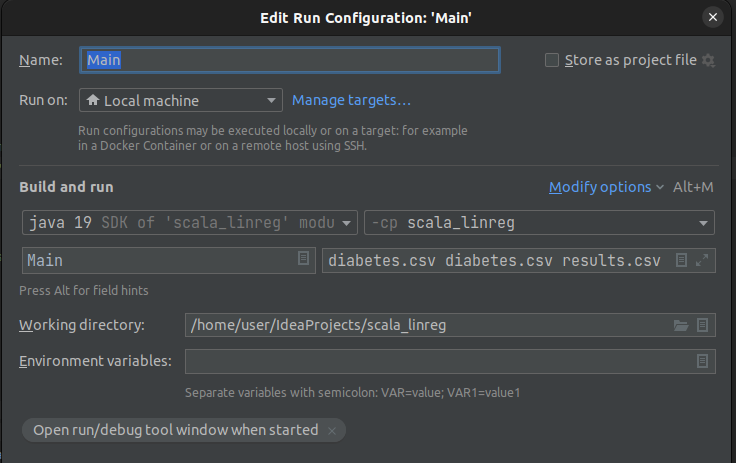
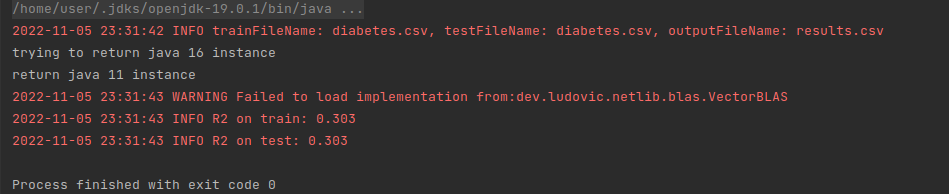

# Запуск:
``
diabetes.csv diabetes.csv results.csv
``

# Вывод
```
2022-11-05 23:31:42 INFO trainFileName: diabetes.csv, testFileName: diabetes.csv, outputFileName: results.csv
2022-11-05 23:31:43 INFO R2 on train: 0.303
2022-11-05 23:31:43 INFO R2 on test: 0.303
```


